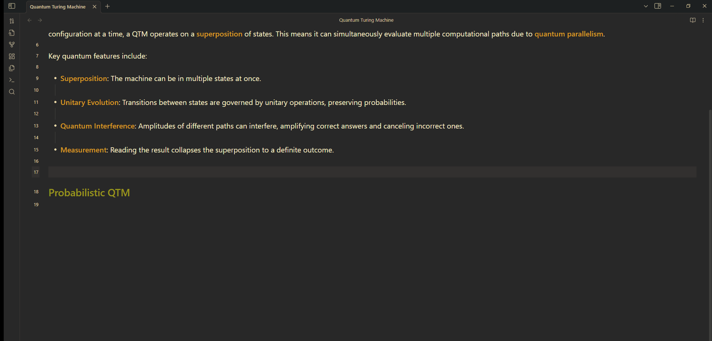
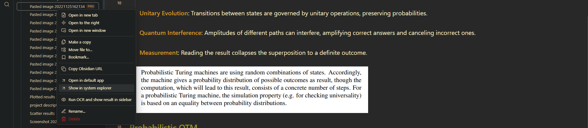

# Multilingual OCR for Obsidian

**Multilingual OCR** is a handy plugin that extract text from images in any langauge.

---

## Features

-   You can apply OCR:
    -   On the _last image_ in the active note.
    -   By typing the absolute/relative _path_ of the intended image.
    -   By _right-clicking_ on the image in obsidian file explorer.
-   Save the OCR result directly into the _clipboard_.
-   Display the OCR result in the _sidebar_ for easy highlighting and copy-pasting.
-   Specify the _language_.
-   RTL support for _Arabic_

---

## Supported file extensions

-   `png`
-   `jpg`
-   `jpeg`

---

## Limitations

-   This plugin uses [Tesseract.js](https://tesseract.projectnaptha.com/), which is not perfect and hence may result in unexpected outputs for some images.
-   The file extensions are limited (could be extended in the future...)

---

## Installation

This plugin could be found on the (Obsidian community plugin repo)[https://obsidian.md/plugins].
